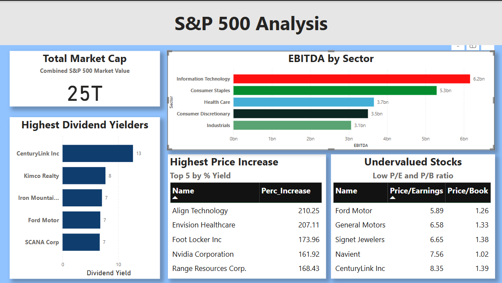

# S&P 500 Financial Dashboard

This project is an analysis of S&P 500 Companies using SQL,PowerBI and Google Sheets.

## Tools
- SQL
- PowerBI

## Dataset
Sourced from http://www.kaggle.com/datasets/paytonfisher/sp-500-companies-with-financial-information. The dataset includes metrics such as:
- Market Cap
- EBITDA
- Dividend Yield
- Price/Earnings Ratio
- Price/Book Ratio

## Data Cleaning
 Swapped 52 Week High and 52 Week Low as the columns were labeled incorrectly.

## Project Summary

This project aims to analyze financial data from S&P 500 companies to uncover valuable investment insights, by trying to understand the following aspects of the given dataset:

- Total Market Cap of S&P 500
- Sectors with the highest EBITDA
- Top dividend-yielding companies
- Stocks with high price increases
- Undervalued opportunities based on P/E and P/B ratios

## Insights

- The total market cap is 25 Trillion Dollars
- CenturyLink Inc provides the highest dividend yiled with 12.66%
- The IT and Consumer Staples have a high average of EBITDA.
- Ford, GM and Navient are good undevalued picks
- CenturyLink Inc is the highest recommended from my analysis as it is undervalued and has a high dividend yield.

## Power BI Dashboard

Dashboard Preview

- **PowerBI file:**[`.pbix file`](powerbi/sp_500_analysis.pbix)

## SQL Analysis

### 1. Total Market Capitalization
- **Query:** [`sql/total_market_cap.sql`](sql/total_market_cap.sql)  

### 2. Percentage Increase from 52 Week Low to High
- **Query:** [`sql/percentage_increase.sql`](sql/percentage_increase.sql)  

### 3. Undervalued Stocks (Low P/E and P/B)
- **Query:** [`sql/value_stocks.sql`](sql/value_stocks.sql)  
- **Logic:** P/E < 15, P/B < 1.5, and P/E > 0  

### 4. Top Sectors by Average EBITDA
- **Query:** [`sql/top_sector_ebitda.sql`](sql/top_sector_ebitda.sql)  

### 5. Top 5 Companies by Dividend Yield
- **Query:** [`sql/top_dividend_yield.sql`](sql/top_dividend_yield.sql)

  

